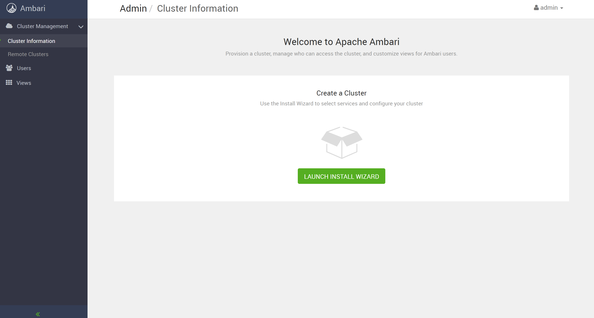
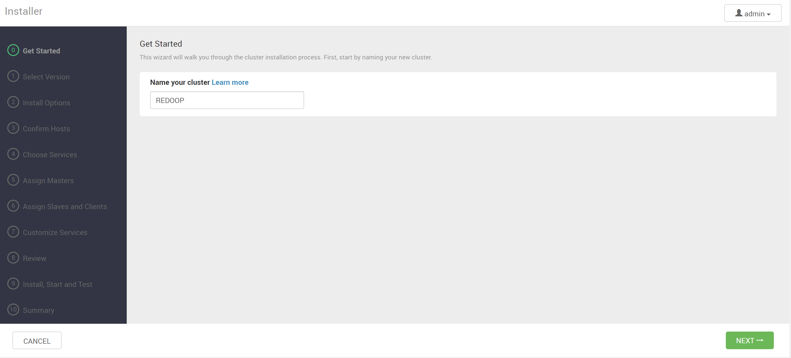
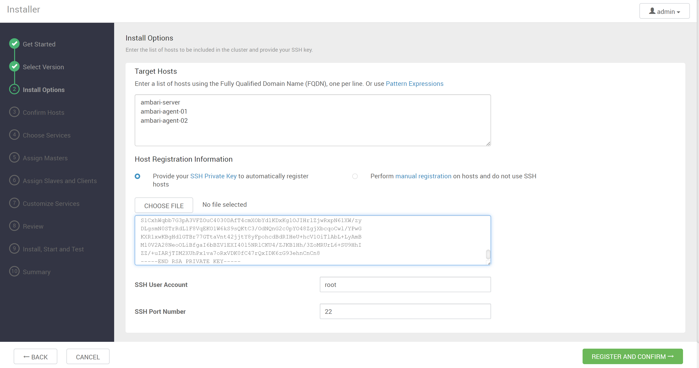
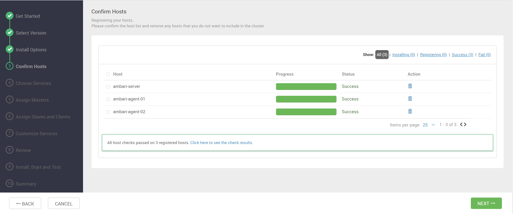

# 添加主机

## 访问 Ambari

* 打开浏览器
* 访问主机：http://ip:8080
* 默认账号：admin
* 默认密码：admin

启动后创建集群，给自己的集群起一个响亮的名字




根据引导创建集群，注意，BaseURL要改成如下：

```
https://redoop-mirrors.oss-cn-hangzhou.aliyuncs.com/apache/snapshots/ambari/stacks/bigtop/3.2.0/centos/7/x86_64/
```


## 添加集群主机

填写对应的主机和安装 Ambari Server 服务的机器的私钥，进行 Ambari Agent 的安装



Ambari Agent 安装完成



至此，集群主机注册成功，下一步就可以在集群上自由的部署组件了

