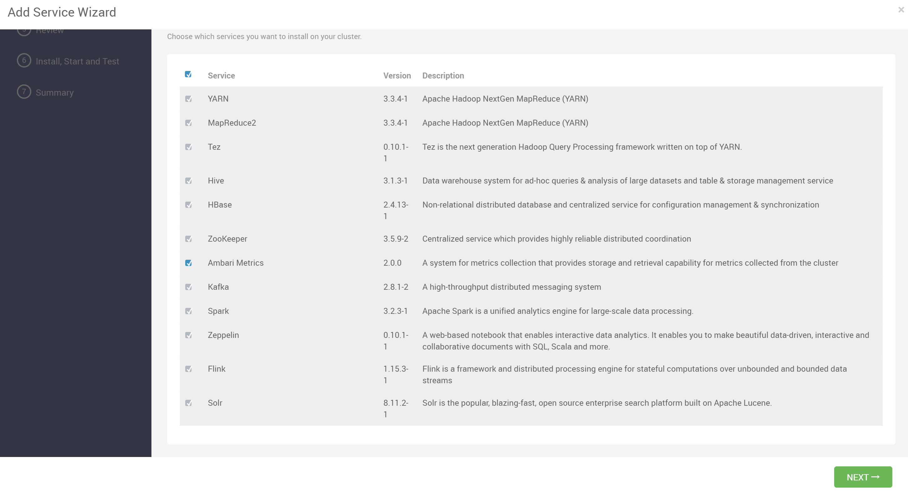
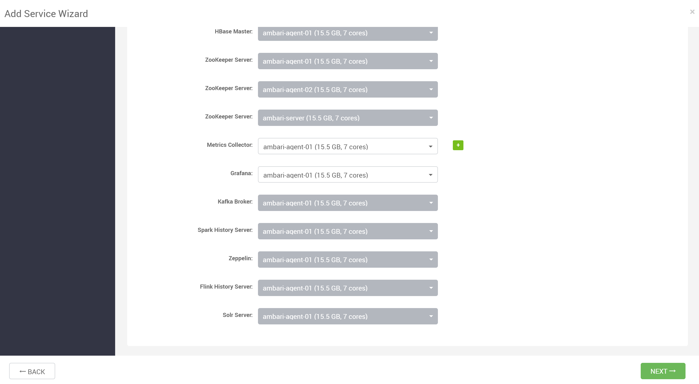
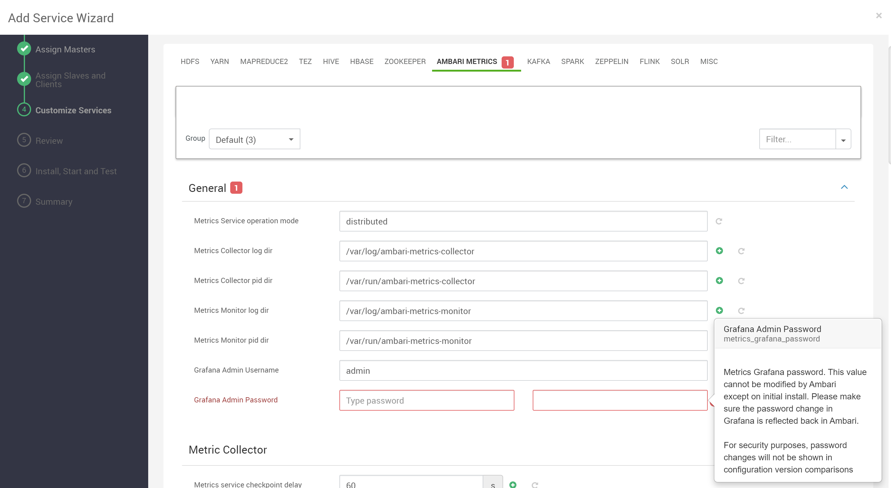
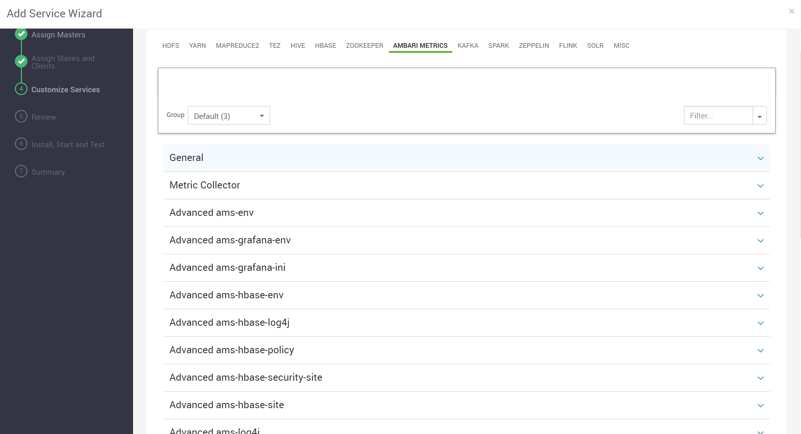
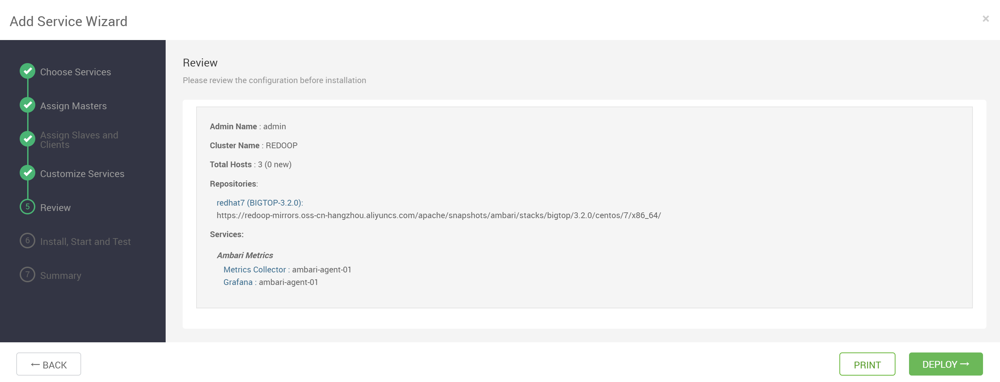
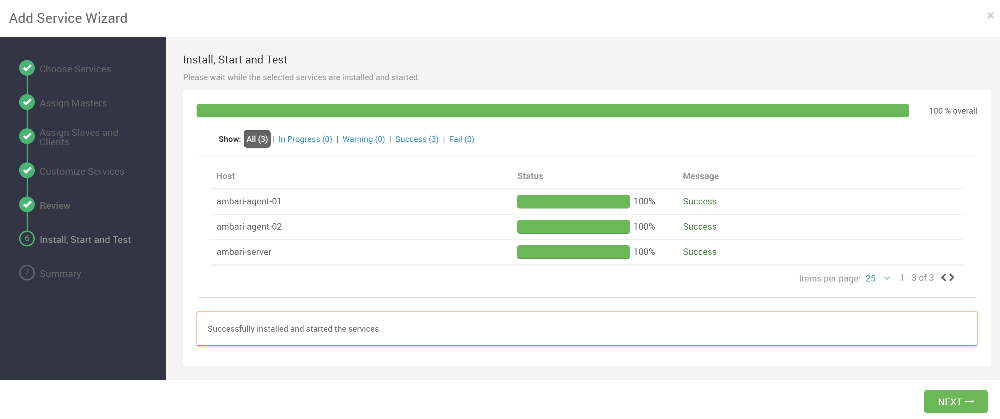
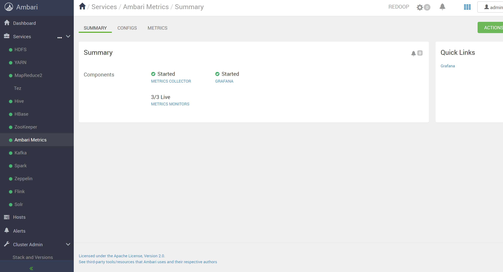

## 添加 Ambari Metrics 服务

安装服务时选中 Ambari Metrics 服务

## 分配主服务

将 Metrics Collector、Grafana 分配给要运行它们的主机

## 自定义配置

配置 Grafana 的初始密码

用户可以根据自己的需求配置其他参数

## 部署服务

检查配置无误后，进行部署

## 部署完成

Hive 服务安装成功

