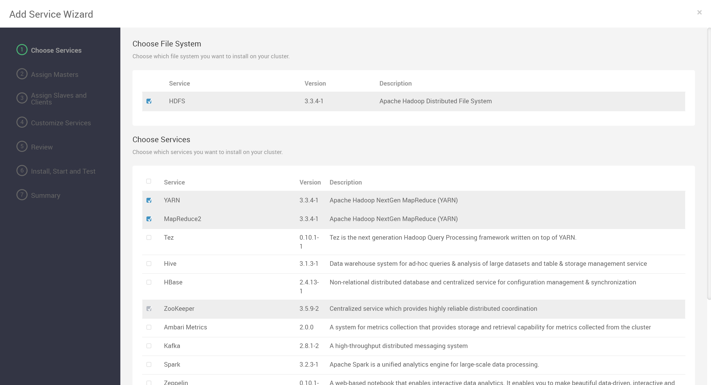
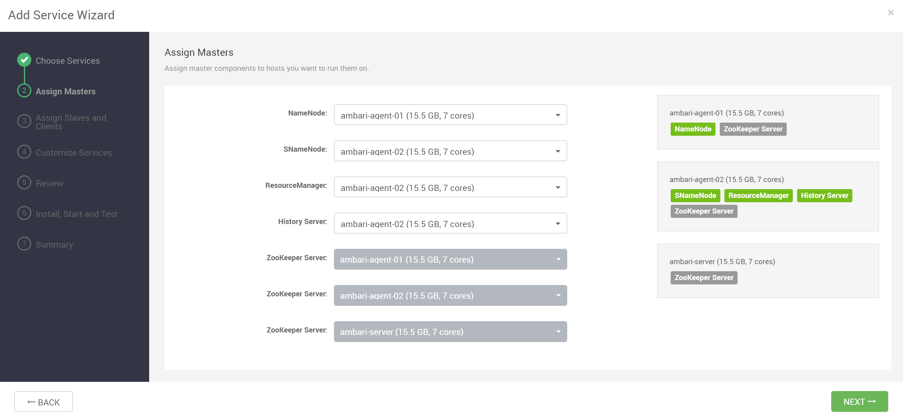
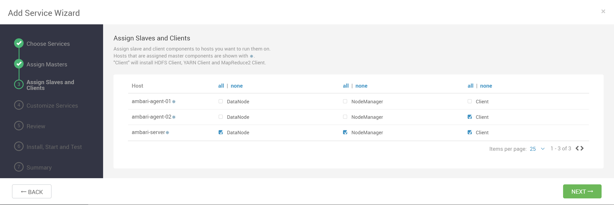
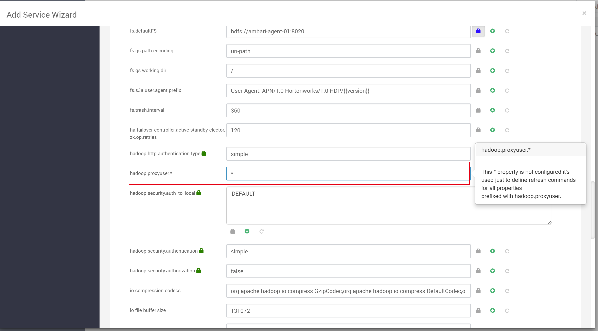
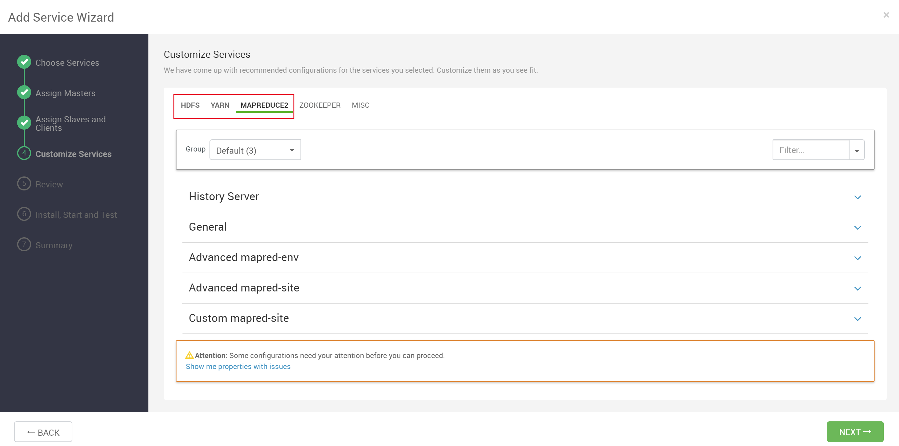
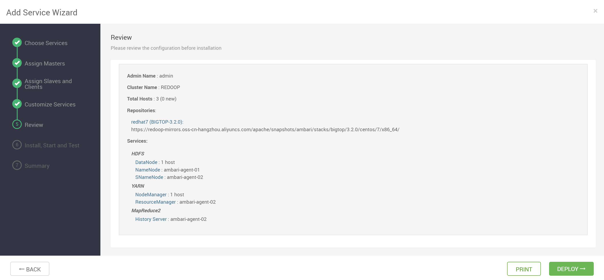
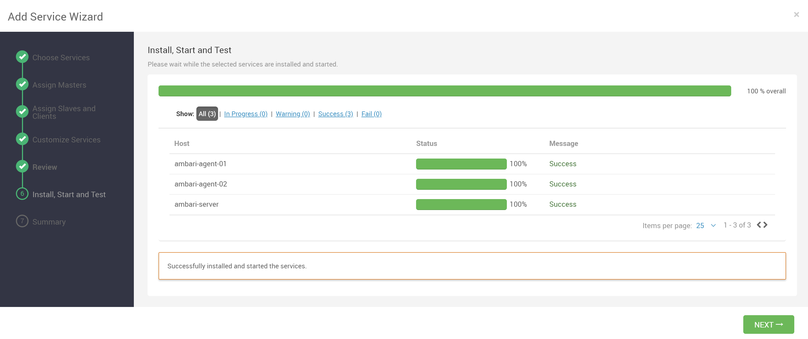
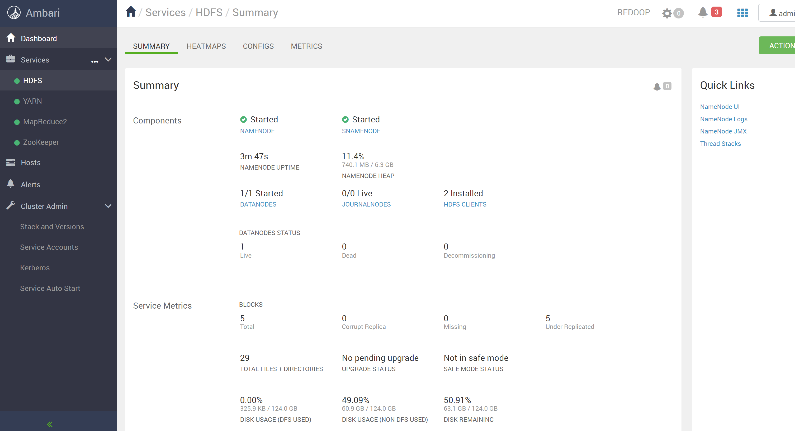

## 添加 Hadoop 服务

Hadoop 服务包括 HDFS、YARN、MapReduce2，此处全部选中

## 分配主服务

将 NameNode、SNameNode、ResourceManager、History Server 分配给要运行它们的主机

## 分配从服务及客户端

将 NodeManager、DataNode 及 HDFS Client、YARN Client、MapReduce2 Client 分配给您要运行它们的主机

## 自定义配置

找到 HDFS 的配置，将 `hadoop.proxyuser.*` 的参数填入 `*`

其余配置用户可按需进行修改

## 部署服务

检查配置无误后，进行部署

## 部署完成

Hadoop 服务安装成功

