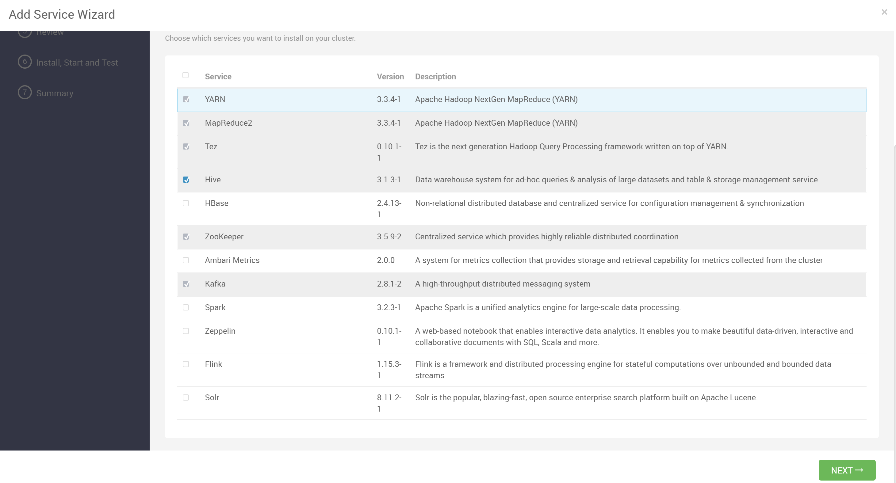
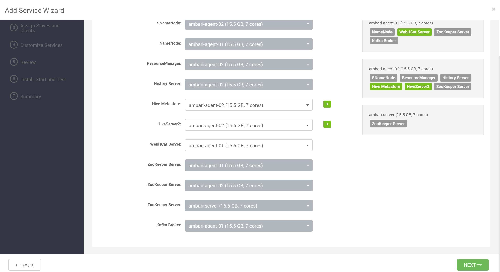
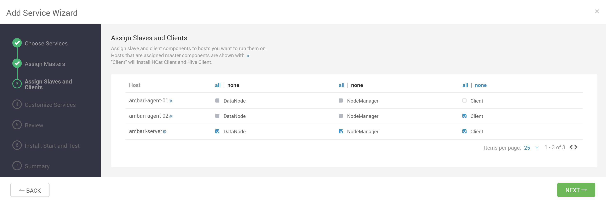
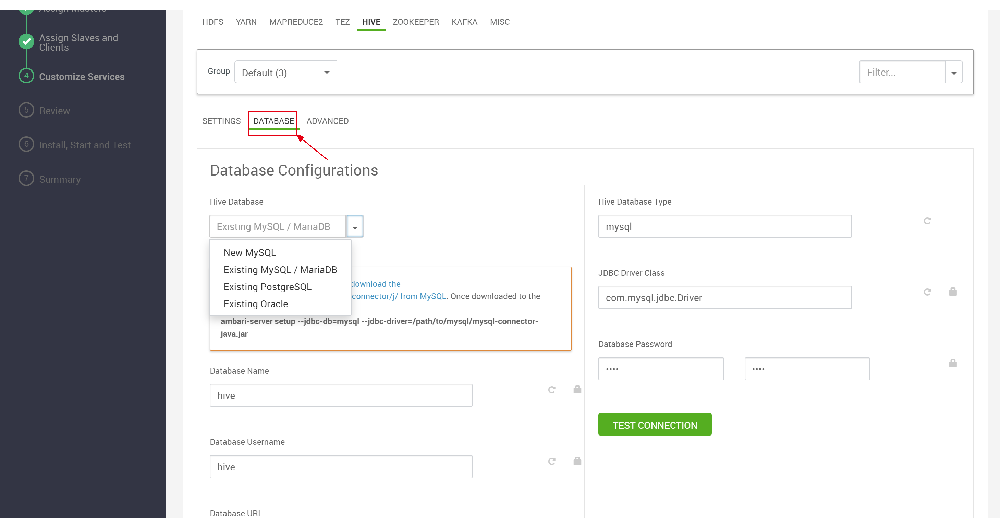
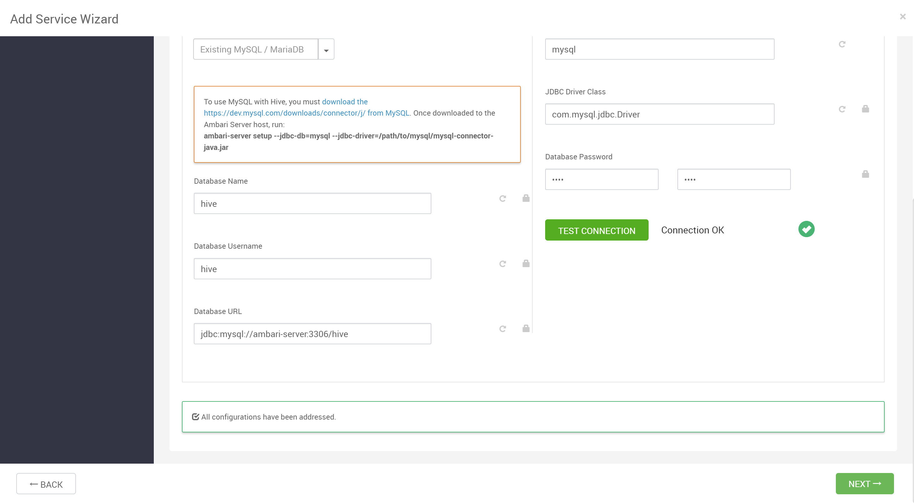
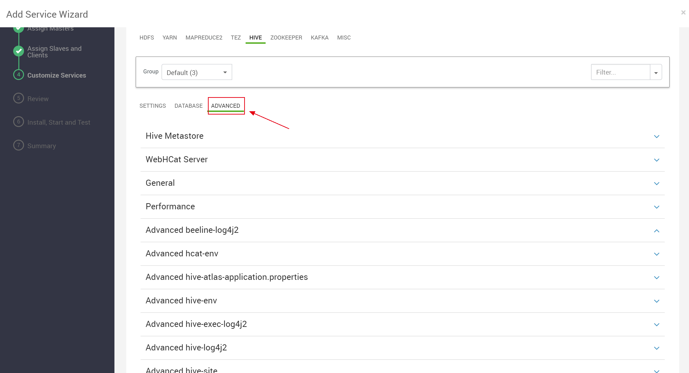
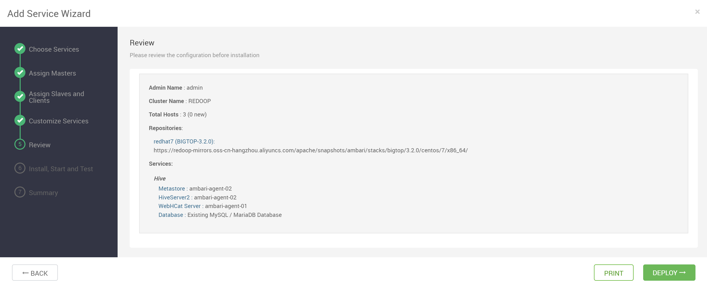
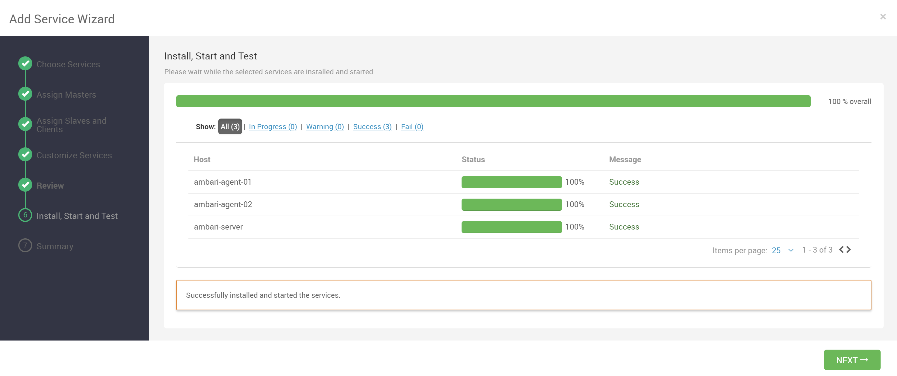
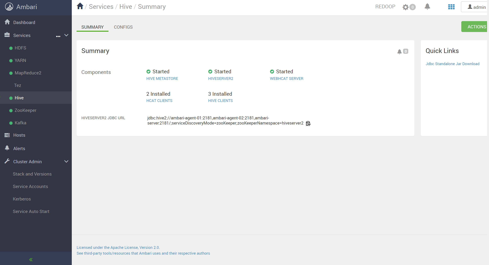

## 添加 Hive 服务

安装服务时选中 Hive 服务

## 分配主服务

将 HiveServer2、Hive MetaStore、WebHCat Server 分配给要运行它们的主机

## 分配从服务及客户端

将 Hive Client、HCat Client 分配给您要运行它们的主机

## 数据库配置

Hive 需要配置对应的元数据库，您可以使用已存在的库，或者让 Ambari 自动帮您创建新的库

点击 Test Connection，测试通过后即可进入下一步

## 自定义配置

用户可以根据自己的需求配置其他参数

## 部署服务

检查配置无误后，进行部署

## 部署完成

Hive 服务安装成功

