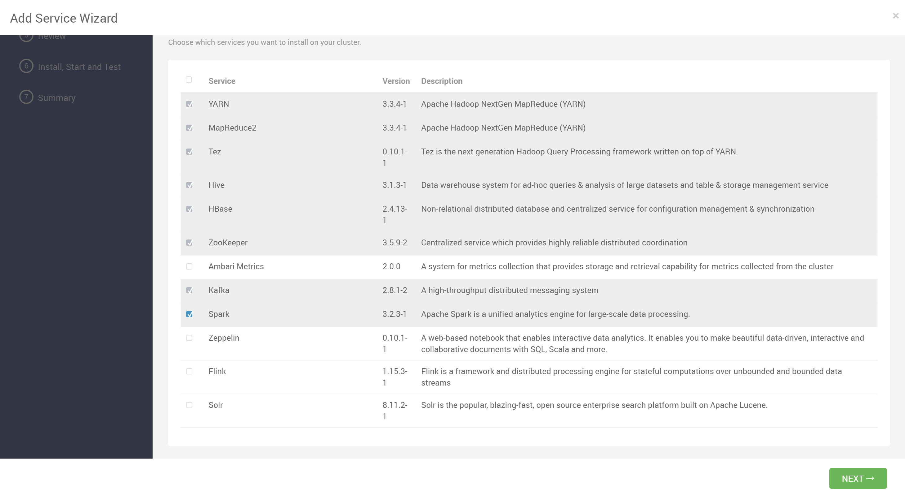
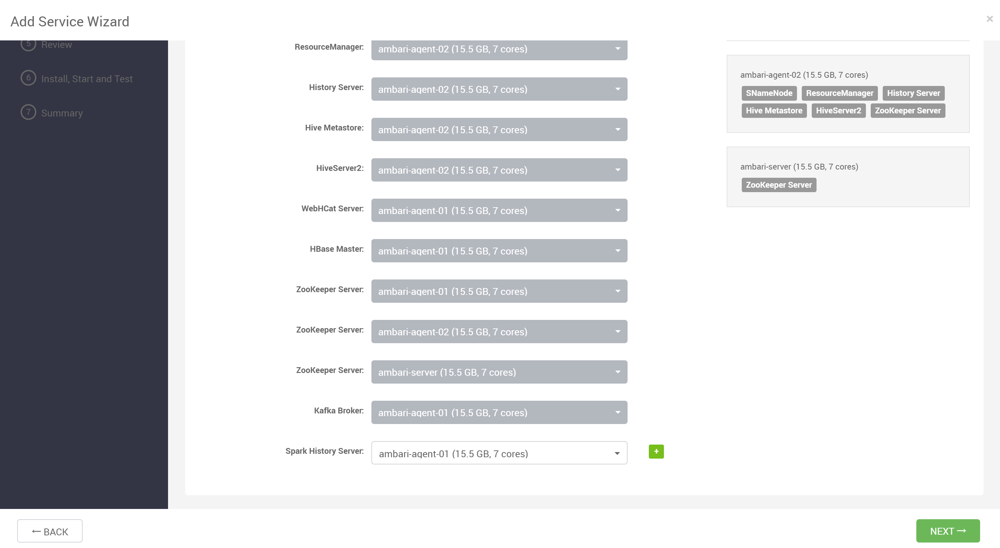
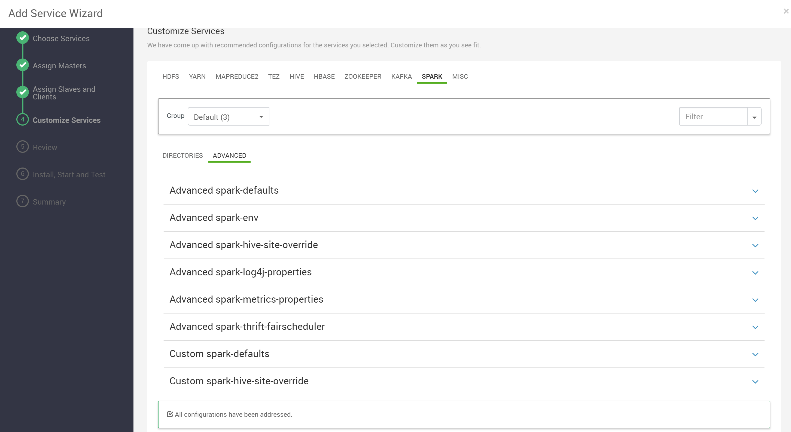

## 添加 Spark 服务

安装服务时选中 Spark 服务

## 分配主服务

将 Spark History Server 分配给要运行它们的主机

## 分配从服务及客户端

将 Spark Thrift Server、Spark Client 分配给您要运行它们的主机

## 自定义配置

用户可以根据自己的需求配置具体参数

## 部署服务

检查配置无误后，进行部署

## 部署完成

Spark 服务安装成功

